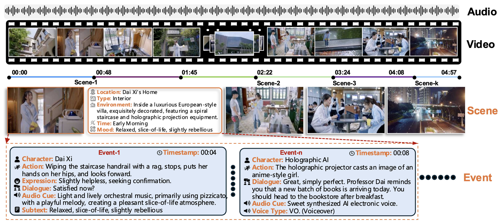
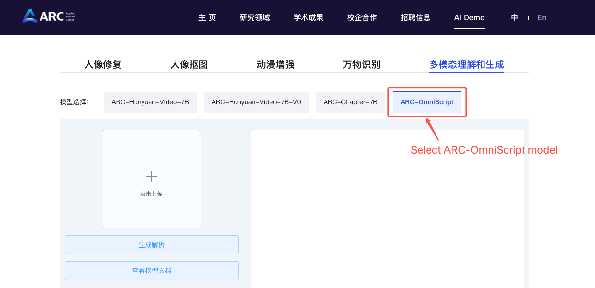
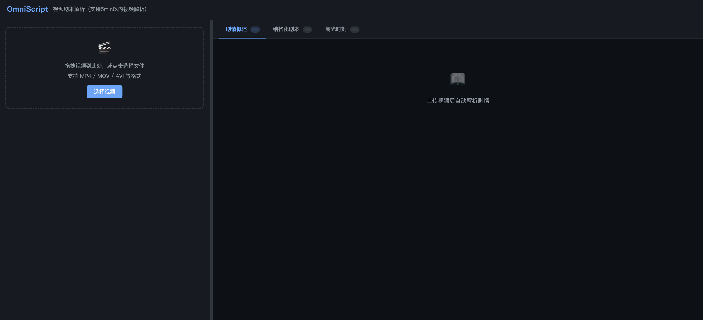
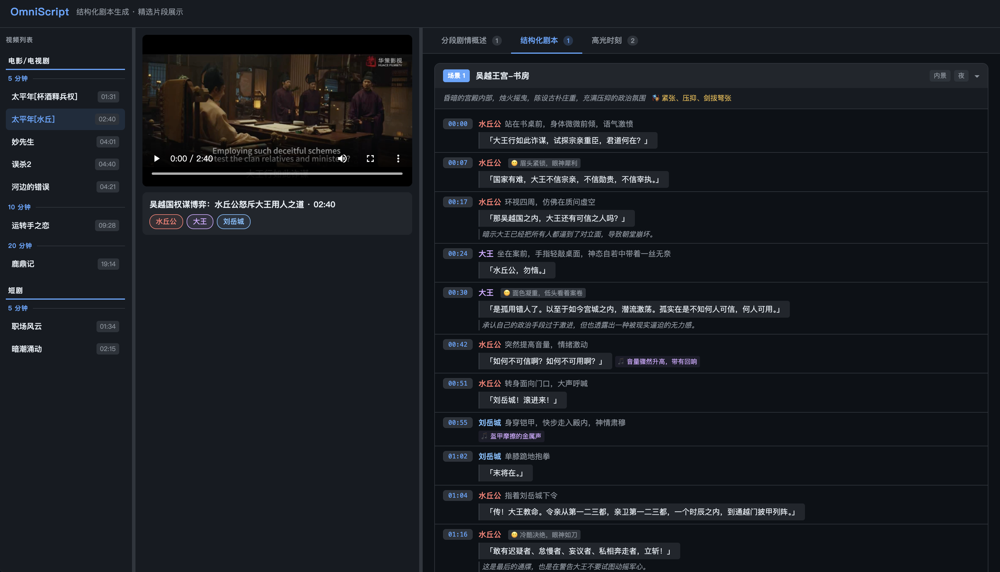

<div align="center">
  
# OmniScript: Towards Audio-Visual Script Generation for Long-Form Cinematic Video

_**[Junfu Pu<sup>\*</sup>](https://pujunfu.github.io/), 
[Yuxin Chen<sup>\*</sup>](https://scholar.google.com/citations?user=dEm4OKAAAAAJ&hl=zh-CN/), 
[Teng Wang<sup>\*</sup>](http://ttengwang.com/), 
[Ying Shan<sup></sup>](https://scholar.google.com/citations?user=4oXBp9UAAAAJ&hl=en)**_
<br>
<sup></sup>**ARC Lab, Tencent**<br>
<sup>\*</sup>**Equal Contribution**

[](https://arxiv.org/abs/2604.11102) &nbsp; 
[](https://arc.tencent.com/zh/ai-demos/multimodal) &nbsp; 
[](https://arc.tencent.com/zh/document/ARC-OmniScript) &nbsp; 
[]()
[](https://arcomniscript.github.io/) &nbsp; 
[](https://arcomniscript.github.io/example/index.html)
</div>

> **Note:** Our code and model weights are currently undergoing internal open-source review. They will be publicly released once the review is complete.

## News
- **[2026/04/24]** The [Online Demo](https://arc.tencent.com/zh/ai-demos/multimodal) and [API Service](https://arc.tencent.com/zh/document/ARC-OmniScript) are now available.
- **[2026/04/22]** Release the [technical report](https://arxiv.org/abs/2604.11102), [project page](https://arcomniscript.github.io/), and [examples](https://arcomniscript.github.io/example/index.html).

## Introduction

OmniScript is an 8B-parameter omni-modal (audio + visual) language model built on Qwen3VL-8B, designed for the **Video-to-Script (V2S)** task: converting long-form cinematic videos into hierarchical, scene-by-scene structured screenplays.

<p align="center">
  
</p>

Given a video (up to 5 minutes natively, or longer via two-stage generation), OmniScript produces:

- **Meta** - title,, character list
- **Scene-level script** - location, environment, time, mood for each scene
- **Event-level script** - timestamped character actions, dialogues, expressions, audio cues, and subtext
- **Chain-of-Thought reasoning** - plot summary and character relationship analysis before structured output

The model is trained via a progressive pipeline: modality alignment (1M videos) &#8594; multimodal pretraining (2.4M videos) &#8594; CoT supervised fine-tuning (45K videos) &#8594; reinforcement learning with temporally segmented rewards (GRPO). Despite its 8B parameter efficiency, OmniScript significantly outperforms larger open-source models and achieves performance comparable to Gemini 3-Pro on both temporal localization and multi-field semantic accuracy.

## Key Results

### Event-level (5-min videos)

| Model | Params | Omni | Char. | Dia. | Act. | Exp. | Aud. | Overall | tIoU@0.1 |
| --- | --- | --- | --- | --- | --- | --- | --- | --- | --- |
| *Proprietary Models* | | | | | | | | | |
| Gemini-3-flash | - | Yes | 28.8 | 50.3 | 28.2 | 25.5 | 11.2 | 28.8 | 44.3 |
| Gemini-3-pro | - | Yes | 39.8 | 68.8 | 37.4 | 35.4 | 13.3 | 38.9 | 64.4 |
| Gemini-2.5-flash | - | Yes | 40.1 | 75.5 | 42.8 | 36.5 | 22.8 | 43.6 | 74.3 |
| Gemini-2.5-pro | - | Yes | 41.7 | 75.0 | 41.9 | 39.0 | 17.0 | 42.9 | 73.4 |
| Seed-1.8 | - | No | 40.9 | 54.4 | 35.1 | 29.6 | 12.4 | 34.5 | 50.7 |
| Seed-2.0-pro | - | No | 47.4 | 68.1 | 42.9 | 35.7 | 10.3 | 40.9 | 67.1 |
| *Open-source Models* | | | | | | | | | |
| Qwen3VL | 8B | No | 30.4 | 49.6 | 26.9 | 25.3 | 6.6 | 27.7 | 47.6 |
| Qwen3VL | 32B | No | 37.1 | 57.1 | 31.3 | 28.7 | 7.2 | 32.3 | 52.5 |
| Qwen3VL | 235B/22B | No | 38.1 | 58.6 | 33.0 | 29.1 | 6.0 | 33.0 | 62.0 |
| TimeChat-Captioner | 8B | Yes | 6.9 | 6.9 | 6.6 | 9.7 | 8.2 | 7.7 | 16.1 |
| MiniCPM-O-4.5 | 9B | Yes | 3.1 | 8.0 | 2.9 | 3.2 | 2.4 | 3.9 | 3.2 |
| **OmniScript (Ours)** | **8B** | **Yes** | **39.2** | **72.2** | **33.7** | **31.9** | **11.6** | **37.7** | **69.3** |

### Scene-level (5-min videos)

| Model | Params | Omni | Loc. | Type | Env. | Time | Mood | Overall | tIoU@0.1 |
| --- | --- | --- | --- | --- | --- | --- | --- | --- | --- |
| *Proprietary Models* | | | | | | | | | |
| Gemini-3-flash | - | Yes | 54.6 | 59.8 | 42.7 | 54.9 | 50.4 | 52.5 | 70.3 |
| Gemini-3-pro | - | Yes | 58.8 | 63.1 | 46.9 | 61.6 | 54.8 | 57.0 | 75.3 |
| Gemini-2.5-flash | - | Yes | 52.8 | 57.1 | 45.7 | 56.1 | 50.3 | 52.3 | 69.6 |
| Gemini-2.5-pro | - | Yes | 56.6 | 62.4 | 50.8 | 60.1 | 54.6 | 56.9 | 74.1 |
| Seed-1.8 | - | No | 57.9 | 58.6 | 47.7 | 58.7 | 52.8 | 55.1 | 74.0 |
| Seed-2.0-pro | - | No | 57.7 | 62.2 | 49.2 | 62.7 | 54.3 | 57.2 | 75.5 |
| *Open-source Models* | | | | | | | | | |
| Qwen3-Omni | 30B/3B | Yes | 18.4 | 26.0 | 14.6 | 23.6 | 22.4 | 21.0 | 29.6 |
| Qwen3VL | 8B | No | 41.3 | 49.7 | 31.8 | 39.8 | 41.7 | 40.9 | 60.6 |
| Qwen3VL | 32B | No | 50.4 | 58.7 | 42.7 | 55.4 | 47.9 | 51.0 | 71.1 |
| Qwen3VL | 235B/22B | No | 52.6 | 60.2 | 45.4 | 57.9 | 50.9 | 53.4 | 72.8 |
| TimeChat-Captioner | 8B | Yes | 19.9 | 29.5 | 17.3 | 28.8 | 30.5 | 25.2 | 46.6 |
| MiniCPM-O-4.5 | 9B | Yes | 10.3 | 22.0 | 8.4 | 17.7 | 17.4 | 15.1 | 32.0 |
| **OmniScript (Ours)** | **8B** | **Yes** | **54.0** | **58.4** | **41.9** | **58.1** | **49.5** | **52.4** | **74.6** |

With only 8B parameters, OmniScript outperforms all open-source models (including Qwen3VL-235B) and achieves performance comparable to proprietary models like Gemini-3-Pro on both event-level and scene-level metrics.

## Online Demo & API
### Online Demo
We provide an [**Online OmniScript Demo**](https://arc.tencent.com/zh/ai-demos/multimodal) hosted on the [ARC Lab website](https://arc.tencent.com) where you can upload a video and experience OmniScript directly - no local setup required.
<p align="center">
    
<p>

**How to find demo on [ARC Lab Homepage](https://arc.tencent.com/en)**:

_[ARC Lab](https://arc.tencent.com/en/index) -> AI Demo -> Register with Phone No. -> Multimodal Comprehension and Generation -> ARC-OmniScript_

### API Service
We provide model access via API service. A brief tutorial on how to use the API is as follow.
For more details,  please refer to the [documentation](https://arc.tencent.com/zh/document/ARC-OmniScript).

_Prior to using the OmniScript API, obtaining an access token (ARC-Token) is mandatory. Users who are not logged in are required to complete account verification first._

_**Steps to get your token:**_
1. _**Log in:** Visit [ARC Website](https://arc.tencent.com) and log in with your mobile number._
1. _**Retrieve Token:** Once logged in, click the user icon in the top-right corner and select "View Token" from the dropdown menu to get your ARC-TOKEN._

## Requirements

- Python >= 3.10
- CUDA-capable GPU (16 GB+ VRAM recommended)
- Conda

```bash
source setup_env.sh
```

This will create a conda environment `omniscript` and install all dependencies (PyTorch, FFmpeg, Flash Attention, etc.).

## Local Web Demo

A Flask-based interface for uploading videos and viewing structured screenplay results with interactive timestamp navigation.

```bash
python demo.py \
    --model_path /path/to/model \
    --whisper_model_path /path/to/whisper-large-v3 \
    --port 8080
```


| Argument               | Default      | Description                                |
| ---------------------- | ------------ | ------------------------------------------ |
| `--model_path`         | *(required)* | Path to the pretrained model checkpoint    |
| `--whisper_model_path` | `None`       | Path to Whisper model for audio processing |
| `--port`               | `8080`       | Port for the Flask server                  |
| `--host`               | `0.0.0.0`    | Listening address                          |
| `--debug`              | `False`      | Use built-in sample data, no GPU needed    |


> If `--whisper_model_path` is not specified, `openai/whisper-large-v3` will be downloaded automatically from HuggingFace.

To quickly preview the UI without a GPU (use `examples/debug.mp4` as the test video):

```bash
python demo.py --debug --port 8080
```



## Command-Line Inference

```bash
python inference.py \
    --model_path /path/to/model \
    --whisper_model_path /path/to/whisper-large-v3 \
    --video_path /path/to/video.mp4

# Save structured output to JSON
python inference.py \
    --model_path /path/to/model \
    --video_path /path/to/video.mp4 \
    --output_json result.json
```


| Argument               | Default      | Description                                |
| ---------------------- | ------------ | ------------------------------------------ |
| `--model_path`         | *(required)* | Path to the pretrained model checkpoint    |
| `--video_path`         | *(required)* | Path to the input video file               |
| `--whisper_model_path` | `None`       | Path to Whisper model for audio processing |
| `--max_new_tokens`     | `8192`       | Maximum number of tokens to generate       |
| `--repetition_penalty` | `1.1`        | Repetition penalty for generation          |
| `--output_json`        | `None`       | Path to save structured JSON output        |


## Output Schema

```
Video --> <thinking> (plot + character relationships) --> Structured JSON
```



```json
{
  "meta": {
    "title": "...",
    "duration": "00:05:00",
    "characters": ["Character A", "Character B"]
  },
  "script": [
    {
      "scene_id": 1,
      "location": "Mansion Living Room",
      "type": "Interior",
      "environment": "Luxuriously decorated villa...",
      "time": "Night",
      "mood": "Tense, Suspenseful",
      "events": [
        {
          "timestamp": "00:05",
          "character": "Character A",
          "action": "Walks in and looks around",
          "expression": "Alert",
          "dialogue": "Is anyone here?",
          "audio_cue": "Creaking door sound"
        }
      ]
    }
  ],
  "high_points": [
    {
      "type": "Emotional Reversal",
      "time_range": ["01:20", "01:35"],
      "description": "...",
      "reasoning": {
        "visual": "...",
        "audio": "...",
        "text": "...",
        "psychology": "..."
      },
      "score": 9.0
    }
  ]
}
```

## File Structure

```
ARC-OmniScript/
|-- demo.py              # Flask web demo with local inference
|-- inference.py         # Command-line inference script
|-- setup_env.sh         # Environment setup script
|-- requirements.txt
|-- examples/            # Example videos for testing
|   |-- demo1.mp4
|   |-- demo2.mp4
|   |-- demo3.mp4
|   +-- demo4.mp4
+-- README.md
```

## Citation

If you find this project helpful, please star our repo and cite our technical report:

```bibtex
@article{pu2026omniscript,
  title={OmniScript: Towards Audio-Visual Script Generation for Long-Form Cinematic Video},
  author={Pu, Junfu and Chen, Yuxin and Wang, Teng and Shan, Ying},
  journal={arXiv preprint arXiv:2604.11102},
  year={2026}
}
```
